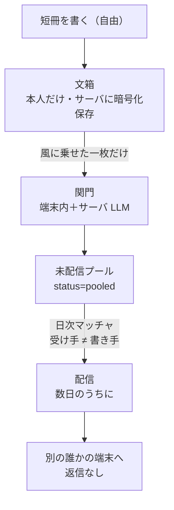

# Karin（夏鈴）

七十二候を背骨に、**季節の言葉を見知らぬ誰かと一枚ずつ匿名で交換する**モバイルアプリ。いいね・フォロワー・通知で速さと承認を競う今の SNS の対極に、季節という共通の話題だけを置いた、静かで急かされない場をつくる。

七十二候は、二十四節気をさらに細かく分けた約 5 日ごとに移る日本の暦で、それぞれに自然の変化を表す名前がつく。Karin はこの候を時間の軸に据える。ユーザーは今日の季節を短い言葉で書き留め（**記録**）、気が向けばその一枚を風に乗せて見知らぬ誰かに送る（**交換**）。記録が主で、交換は従である。

二つの体験は風鈴になぞらえる。短冊が記録に、風が交換に、鈴が受信にあたる。

## 設計原則（作らないもの）

予算ではなく、Karin が Karin であるための制約として、次を作らない。

- **AI に言葉を代筆させない** — 書くのは人で、AI は安全の判定という裏方に徹する。
- **承認を煽らない** — 通知・ストリーク・いいね・フォロワーを持たない。
- **写真は交換しない** — 交換するのは言葉だけ。

## アーキテクチャ

データは、本人だけのものである**記録**と、見知らぬ他人に渡る**交換**の二層に分かれる。記録は本人以外に見せたくない私的な日記でサーバを通す必要がなく、交換は見知らぬ他人に届ける以上サーバ側で害がないかを確かめてからでないと配れない。同じデータとして扱うと両立しないため、二層に分ける。

- **クライアント**: モバイルアプリ（Flutter / ネイティブは未確定）。
- **サーバ**: Go（API・匿名認証・記録保存・未配信プール・日次マッチャ・関門の制御）。
- **インフラ**: マネージド PostgreSQL・スケジュール実行・外部 LLM API（関門）をマネージド部品に寄せ、自前で運用するのはアプリケーションのロジックに絞る。

詳細な要件（Why/What）とアーキテクチャ（How）はドキュメントが定める（`docs/` に整備予定）。

## 段階リリース

- **第0段階**（〜1ヶ月）: 七十二候データの整備とブランドの確定。
- **第1段階**（1〜4ヶ月）: 記録だけの MVP（無料）。30 日継続率を検証。
- **第2段階**（4〜8ヶ月）: 交換と安全機能を実装。
- **第3段階**（8ヶ月〜）: 課金・年額へ誘導。

## 開発に参加する

ブランチ・PR・コミットの規約は [CONTRIBUTING.md](CONTRIBUTING.md) に従う。要点は **Issue → PR → コミットを 1:1 で対応させ、`main` を直線履歴に保つ**こと。CI が全 PR で検証する。
